# DIU Job Hub

A full-stack, role-based university job platform built for **Daffodil International University** — connecting students with recruiters through AI-powered job matching, academic eligibility scoring, and a premium glassmorphism UI.

## ✨ Features

### 🔍 Job Seeker Portal
- Browse and search jobs with filters (type, level, location, remote)
- Apply to jobs with one click
- **AI Job Finder** — matches your skills & academic profile against all jobs using Groq LLM (with local fallback)
- **Eligibility Checker** — scores your academic profile against job roles
- Save/bookmark jobs for later
- Manage profile, skills (with proficiency levels), and academic records
- Track application status through pipeline stages (Applied → In Review → Interviewing → Offer)

### 🏢 Recruiter Portal
- Post new jobs (publish or save as draft)
- Review applicants with **full profile details** — skills, CGPA, university, semester, academic records
- Filter applicants: All / Shortlisted / Interview / Hired / Rejected
- Update candidate status with one click
- Manage and delete job listings
- Dashboard analytics with views, responses, and applicant scores

### 🛡️ Admin Panel
- System-wide statistics dashboard
- Configure AI provider (Groq / Local) with API key and model settings
- Audit log for tracking system activity

## 🛠️ Tech Stack

| Layer | Technology |
|---|---|
| Framework | Next.js 15 (App Router) |
| Language | TypeScript |
| UI | React 18, Tailwind CSS, Radix UI primitives |
| Data Fetching | TanStack React Query |
| Icons | Lucide React |
| Toasts | Sonner |
| Charts | Recharts |
| AI | Groq SDK (with local scoring fallback) |
| Database | MySQL (via mysql2) |
| Server | Next.js API Routes (no separate backend) |

## 📁 Project Structure

```text
diu-job-hub/
├── database/               # SQL schema & migrations
│   ├── JOBHUBDIU_super_clean_final.sql
│   ├── 001_dynamic_updates.sql
│   ├── 002_audit_log.sql
│   └── academic_records_migration.sql
├── public/
├── src/
│   ├── app/                # Next.js App Router pages & API routes
│   │   ├── api/            # 15 API route groups
│   │   ├── admin/          # Admin panel pages
│   │   ├── dashboard/      # Seeker dashboard pages
│   │   ├── employer/       # Recruiter portal pages
│   │   ├── jobs/           # Job listing & detail pages
│   │   ├── login/
│   │   ├── register/
│   │   ├── layout.tsx      # Root layout
│   │   └── providers.tsx   # Query, Auth, AI, Toast providers
│   ├── components/         # Shared UI components
│   │   ├── layout/         # Navbar, DashboardLayout, EmployerLayout, AdminLayout
│   │   ├── ui/             # Button, Tooltip, Toast (shadcn/ui)
│   │   ├── Hero.tsx
│   │   ├── JobCard.tsx
│   │   └── FilterSidebar.tsx
│   ├── context/            # AuthContext, AIConfigContext
│   ├── data/               # Local eligibility scoring engine
│   ├── hooks/              # useAPI.ts (all frontend API hooks)
│   ├── lib/                # Utilities + Next.js router compatibility shim
│   ├── server/             # jobhub-db.ts (MySQL data access layer)
│   ├── views/              # Page-level view components
│   │   ├── auth/           # Login, Register
│   │   ├── dashboard/      # Overview, Applied, Saved, Eligibility, etc.
│   │   ├── employer/       # PostJob, Applicants, ManageJobs, EmployerOverview
│   │   ├── admin/          # AdminOverview, AISettings, AuditLog
│   │   ├── Index.tsx       # Landing page
│   │   ├── Jobs.tsx        # Job listing
│   │   └── JobDetail.tsx   # Job detail
│   └── types.ts            # Shared TypeScript types
├── .env.example
├── .env.local
├── next.config.ts
├── tailwind.config.ts
├── tsconfig.json
└── package.json
```

## 🗺️ Routes

### Public
| Route | Description |
|---|---|
| `/` | Landing page with hero search |
| `/jobs` | Browse all jobs with filters |
| `/jobs/[id]` | Job detail with apply/save |
| `/login` | Sign in |
| `/register` | Create account |

### Job Seeker (`/dashboard`)
| Route | Description |
|---|---|
| `/dashboard` | Overview with stats & recent applications |
| `/dashboard/applied` | All submitted applications |
| `/dashboard/saved` | Bookmarked jobs |
| `/dashboard/eligibility` | AI-powered job matching |
| `/dashboard/recommended` | Role recommendations based on profile |
| `/dashboard/skills` | Manage skills & proficiency levels |
| `/dashboard/academic` | Academic records (courses, CGPA) |
| `/dashboard/profile` | Edit personal profile |

### Recruiter (`/employer`)
| Route | Description |
|---|---|
| `/employer` | Dashboard with job analytics |
| `/employer/post-job` | Create new job listing |
| `/employer/applicants` | Review candidates with full profiles |
| `/employer/manage-jobs` | Edit, delete, and configure jobs |

### Admin (`/admin`)
| Route | Description |
|---|---|
| `/admin` | System statistics dashboard |
| `/admin/ai-settings` | Configure AI provider & model |
| `/admin/audit-log` | View system activity log |

## 🔌 API Endpoints

### Authentication
- `POST /api/auth/login` — Sign in with email/password
- `POST /api/auth/register` — Create new account

### Jobs
- `GET /api/jobs` — List all active jobs
- `GET /api/jobs/[id]` — Get job by ID
- `POST /api/jobs` — Create a new job listing

### Applications
- `GET /api/applications?userId=` — List user's applications
- `POST /api/applications` — Apply to a job
- `DELETE /api/applications/[id]` — Cancel application

### Candidates (Recruiter)
- `GET /api/candidates?company=` — List applicants with profile details
- `PUT /api/candidates` — Update candidate status
- `DELETE /api/candidates?id=` — Remove candidate

### Employer Jobs
- `GET /api/employer-jobs?company=` — List employer's jobs with analytics
- `PUT /api/employer-jobs` — Update job settings
- `DELETE /api/employer-jobs?id=` — Delete a job

### Profile & Skills
- `GET /api/profile?userId=` — Get user profile
- `PUT /api/profile` — Update profile
- `GET /api/skills?userId=` — Get skills
- `PUT /api/skills` — Update skills

### Academic Records
- `GET /api/academic?userId=` — Get academic records
- `PUT /api/academic` — Save records
- `DELETE /api/academic?id=&userId=` — Delete record

### Saved Jobs
- `GET /api/saved-jobs?userId=` — List saved jobs
- `POST /api/saved-jobs` — Save a job
- `DELETE /api/saved-jobs/[jobId]?userId=` — Unsave a job

### AI & Analytics
- `POST /api/ai-match` — AI-powered job matching
- `GET /api/recommendations` — Get role recommendations
- `GET /api/stats?userId=` — Get dashboard statistics
- `GET /api/analytics?company=` — Weekly analytics data

### System (Admin)
- `GET /api/settings` — Get AI configuration
- `PUT /api/settings` — Update AI configuration
- `GET /api/audit-logs` — Get audit trail

## 💾 Database Setup

The app uses a MySQL database named `JOBHUBDIU`. Run the SQL files in order:

```bash
# 1. Base schema + seed data
mysql -u root < database/JOBHUBDIU_super_clean_final.sql

# 2. Dynamic updates (analytics, settings tables)
mysql -u root JOBHUBDIU < database/001_dynamic_updates.sql

# 3. Audit log table
mysql -u root JOBHUBDIU < database/002_audit_log.sql

# 4. Academic records table
mysql -u root JOBHUBDIU < database/academic_records_migration.sql
```

Or import via phpMyAdmin / XAMPP if preferred.

## 📐 Database Schema

### ER Diagram

```mermaid
erDiagram
    users ||--o| user_profiles : "has profile"
    users ||--o{ applications : "submits"
    users ||--o{ saved_jobs : "bookmarks"
    users ||--o{ academic_records : "has records"
    users ||--o{ audit_log : "triggers"

    jobs ||--o{ applications : "receives"
    jobs ||--o{ saved_jobs : "saved in"
    jobs ||--o{ candidates : "has candidates"
    jobs ||--o{ job_analytics : "tracked by"

    users {
        VARCHAR_50 id PK "Primary Key"
        VARCHAR_100 name "NOT NULL"
        VARCHAR_100 email UK "Unique"
        VARCHAR_255 password "NOT NULL"
        VARCHAR_20 role "seeker | employer | admin"
        VARCHAR_5 initials "NOT NULL"
    }

    user_profiles {
        INT id PK "Auto Increment"
        VARCHAR_50 user_id FK "→ users.id (CASCADE)"
        VARCHAR_150 company_name "Nullable"
        VARCHAR_150 university "Nullable"
        FLOAT cgpa "Nullable"
        INT semester "Nullable"
        TEXT experience "Nullable"
        JSON skills_json "Nullable"
        JSON courses_json "Nullable"
        VARCHAR_20 phone "Nullable"
        VARCHAR_50 reg_id "Nullable"
    }

    jobs {
        VARCHAR_50 id PK "Primary Key"
        VARCHAR_150 title "Nullable"
        VARCHAR_100 company "Nullable"
        VARCHAR_10 logo "Emoji / Initial"
        VARCHAR_100 logoBg "Tailwind gradient class"
        VARCHAR_100 location "Nullable"
        VARCHAR_50 type "Full-time | Remote | Contract"
        VARCHAR_50 level "Mid | Senior | Lead"
        VARCHAR_100 salary "Nullable"
        VARCHAR_50 posted "Nullable"
        TEXT description "Nullable"
        INT applicants "DEFAULT 0"
        TINYINT remote "0 or 1"
        JSON tags "Nullable"
        JSON responsibilities "Nullable"
        JSON requirements "Nullable"
        INT views "DEFAULT 0"
        VARCHAR_50 status "DEFAULT Active"
        TINYINT ai_screening "DEFAULT 1 (migration)"
        INT min_score "DEFAULT 60 (migration)"
        VARCHAR_50 role_mapping "DEFAULT web-developer (migration)"
    }

    applications {
        INT id PK "Auto Increment"
        VARCHAR_50 user_id FK "→ users.id (CASCADE)"
        VARCHAR_50 job_id FK "→ jobs.id (CASCADE)"
        VARCHAR_50 status "Applied | In Review | Interviewing"
        VARCHAR_50 applied_at "Nullable"
        INT stage "Pipeline stage number"
    }

    saved_jobs {
        INT id PK "Auto Increment"
        VARCHAR_50 user_id FK "→ users.id (CASCADE)"
        VARCHAR_50 job_id FK "→ jobs.id (CASCADE)"
        TIMESTAMP saved_at "DEFAULT CURRENT_TIMESTAMP"
    }

    candidates {
        VARCHAR_50 id PK "Primary Key"
        VARCHAR_100 name "Nullable"
        VARCHAR_10 initials "Nullable"
        VARCHAR_100 role "Nullable"
        VARCHAR_50 job_id FK "→ jobs.id (CASCADE)"
        VARCHAR_150 job_title "Nullable"
        INT match_score "AI match percentage"
        VARCHAR_50 experience "Nullable"
        VARCHAR_100 location "Nullable"
        VARCHAR_50 applied_at "Nullable"
        VARCHAR_50 status "Shortlisted | New | Interviewing"
        JSON skills "Nullable"
    }

    academic_records {
        INT id PK "Auto Increment"
        VARCHAR_50 user_id FK "→ users.id (CASCADE)"
        INT semester "NOT NULL"
        VARCHAR_20 course_code "NOT NULL"
        VARCHAR_150 course_name "NOT NULL"
        FLOAT credit "DEFAULT 3.0"
        FLOAT cgpa "Grade point out of 4.0"
        TIMESTAMP created_at "DEFAULT CURRENT_TIMESTAMP"
    }

    job_roles {
        VARCHAR_50 id PK "Primary Key"
        VARCHAR_150 title "NOT NULL"
        TEXT description "NOT NULL"
        JSON required_courses "NOT NULL"
        JSON preferred_skills "NOT NULL"
        INT min_semester "NOT NULL"
        INT default_threshold "NOT NULL"
    }

    job_analytics {
        INT id PK "Auto Increment"
        VARCHAR_50 job_id FK "→ jobs.id (CASCADE)"
        DATE date "NOT NULL"
        INT views "DEFAULT 0"
        INT responses "DEFAULT 0"
    }

    system_settings {
        VARCHAR_50 setting_key PK "Primary Key"
        JSON setting_value "Nullable"
    }

    audit_log {
        INT id PK "Auto Increment"
        VARCHAR_50 action "INSERT | UPDATE | DELETE"
        VARCHAR_100 table_name "NOT NULL"
        VARCHAR_50 record_id "Nullable"
        VARCHAR_50 user_id "Nullable"
        JSON old_data "Nullable"
        JSON new_data "Nullable"
        VARCHAR_255 description "Nullable"
        TIMESTAMP created_at "DEFAULT CURRENT_TIMESTAMP"
    }
```



---

### Table Details

#### `users` — Registered accounts (seekers, employers, admins)

| Column | Type | Constraints | Description |
|---|---|---|---|
| `id` | VARCHAR(50) | **PK** | Unique user identifier |
| `name` | VARCHAR(100) | NOT NULL | Full name or company name |
| `email` | VARCHAR(100) | NOT NULL, **UNIQUE** | Login email |
| `password` | VARCHAR(255) | NOT NULL | Plain-text password (demo only) |
| `role` | VARCHAR(20) | NOT NULL | `seeker` · `employer` · `admin` |
| `initials` | VARCHAR(5) | NOT NULL | Avatar initials |

---

#### `user_profiles` — Extended profile data for seekers & employers

| Column | Type | Constraints | Description |
|---|---|---|---|
| `id` | INT | **PK**, AUTO_INCREMENT | — |
| `user_id` | VARCHAR(50) | **FK → users.id** (CASCADE) | One-to-one link |
| `company_name` | VARCHAR(150) | — | Employer's company |
| `university` | VARCHAR(150) | — | Seeker's university |
| `cgpa` | FLOAT | — | Cumulative GPA |
| `semester` | INT | — | Current semester |
| `experience` | TEXT | — | Work experience description |
| `skills_json` | JSON | — | Array of skill objects |
| `courses_json` | JSON | — | Array of completed courses |
| `phone` | VARCHAR(20) | — | Contact number |
| `reg_id` | VARCHAR(50) | — | University registration ID |

---

#### `jobs` — Job listings posted by employers

| Column | Type | Constraints | Description |
|---|---|---|---|
| `id` | VARCHAR(50) | **PK** | Job identifier |
| `title` | VARCHAR(150) | — | Job title |
| `company` | VARCHAR(100) | — | Company name |
| `logo` | VARCHAR(10) | — | Single character / emoji |
| `logoBg` | VARCHAR(100) | — | Tailwind gradient classes |
| `location` | VARCHAR(100) | — | Office location or "Remote" |
| `type` | VARCHAR(50) | — | Full-time · Remote · Contract |
| `level` | VARCHAR(50) | — | Mid · Senior · Lead |
| `salary` | VARCHAR(100) | — | Salary range string |
| `posted` | VARCHAR(50) | — | Human-readable post date |
| `description` | TEXT | — | Full job description |
| `applicants` | INT | DEFAULT 0 | Applicant counter |
| `remote` | TINYINT(1) | DEFAULT 0 | Remote flag |
| `tags` | JSON | — | Skill tags array |
| `responsibilities` | JSON | — | Responsibility list |
| `requirements` | JSON | — | Requirement list |
| `views` | INT | DEFAULT 0 | View counter |
| `status` | VARCHAR(50) | DEFAULT 'Active' | Active · Draft · Closed |
| `ai_screening` | TINYINT(1) | DEFAULT 1 | Enable AI screening *(migration)* |
| `min_score` | INT | DEFAULT 60 | Minimum AI match score *(migration)* |
| `role_mapping` | VARCHAR(50) | DEFAULT 'web-developer' | Linked job role ID *(migration)* |

---

#### `applications` — Job applications submitted by seekers

| Column | Type | Constraints | Description |
|---|---|---|---|
| `id` | INT | **PK**, AUTO_INCREMENT | — |
| `user_id` | VARCHAR(50) | **FK → users.id** (CASCADE) | Applicant |
| `job_id` | VARCHAR(50) | **FK → jobs.id** (CASCADE) | Target job |
| `status` | VARCHAR(50) | — | Applied · In Review · Interviewing |
| `applied_at` | VARCHAR(50) | — | Human-readable date |
| `stage` | INT | — | Pipeline stage (1–4) |

---

#### `saved_jobs` — Bookmarked jobs per user

| Column | Type | Constraints | Description |
|---|---|---|---|
| `id` | INT | **PK**, AUTO_INCREMENT | — |
| `user_id` | VARCHAR(50) | **FK → users.id** (CASCADE) | Who saved |
| `job_id` | VARCHAR(50) | **FK → jobs.id** (CASCADE) | Which job |
| `saved_at` | TIMESTAMP | DEFAULT CURRENT_TIMESTAMP | When saved |

> **Unique constraint**: `(user_id, job_id)` — prevents duplicate bookmarks.

---

#### `candidates` — Recruiter-facing applicant records

| Column | Type | Constraints | Description |
|---|---|---|---|
| `id` | VARCHAR(50) | **PK** | Candidate identifier |
| `name` | VARCHAR(100) | — | Candidate name |
| `initials` | VARCHAR(10) | — | Avatar initials |
| `role` | VARCHAR(100) | — | Applied role title |
| `job_id` | VARCHAR(50) | **FK → jobs.id** (CASCADE) | Target job |
| `job_title` | VARCHAR(150) | — | Denormalized job title |
| `match_score` | INT | — | AI match score (0–100) |
| `experience` | VARCHAR(50) | — | Years of experience |
| `location` | VARCHAR(100) | — | Candidate location |
| `applied_at` | VARCHAR(50) | — | Relative time string |
| `status` | VARCHAR(50) | — | New · Shortlisted · Interviewing |
| `skills` | JSON | — | Skill tags array |

---

#### `academic_records` — Per-course grades for seekers

| Column | Type | Constraints | Description |
|---|---|---|---|
| `id` | INT | **PK**, AUTO_INCREMENT | — |
| `user_id` | VARCHAR(50) | **FK → users.id** (CASCADE) | Student |
| `semester` | INT | NOT NULL | Semester number |
| `course_code` | VARCHAR(20) | NOT NULL | e.g. CSE-301 |
| `course_name` | VARCHAR(150) | NOT NULL | Full course title |
| `credit` | FLOAT | DEFAULT 3.0 | Credit hours |
| `cgpa` | FLOAT | DEFAULT 0.0 | Grade point for this course (0–4.0) |
| `created_at` | TIMESTAMP | DEFAULT CURRENT_TIMESTAMP | Record timestamp |

---

#### `job_roles` — Predefined role templates for eligibility scoring

| Column | Type | Constraints | Description |
|---|---|---|---|
| `id` | VARCHAR(50) | **PK** | e.g. `web-developer` |
| `title` | VARCHAR(150) | NOT NULL | Display title |
| `description` | TEXT | NOT NULL | Role description |
| `required_courses` | JSON | NOT NULL | Courses needed |
| `preferred_skills` | JSON | NOT NULL | Preferred skill tags |
| `min_semester` | INT | NOT NULL | Minimum semester to qualify |
| `default_threshold` | INT | NOT NULL | Default eligibility score |

---

#### `job_analytics` — Daily view/response tracking per job

| Column | Type | Constraints | Description |
|---|---|---|---|
| `id` | INT | **PK**, AUTO_INCREMENT | — |
| `job_id` | VARCHAR(50) | **FK → jobs.id** (CASCADE) | Tracked job |
| `date` | DATE | NOT NULL | Calendar date |
| `views` | INT | DEFAULT 0 | Page views on that date |
| `responses` | INT | DEFAULT 0 | Applications on that date |

---

#### `system_settings` — Key-value configuration store

| Column | Type | Constraints | Description |
|---|---|---|---|
| `setting_key` | VARCHAR(50) | **PK** | Setting identifier (e.g. `ai_config`) |
| `setting_value` | JSON | — | Arbitrary config payload |

---

#### `audit_log` — Immutable event journal

| Column | Type | Constraints | Description |
|---|---|---|---|
| `id` | INT | **PK**, AUTO_INCREMENT | — |
| `action` | VARCHAR(50) | NOT NULL | `INSERT` · `UPDATE` · `DELETE` |
| `table_name` | VARCHAR(100) | NOT NULL | Source table name |
| `record_id` | VARCHAR(50) | — | Affected record ID |
| `user_id` | VARCHAR(50) | — | Who triggered the action |
| `old_data` | JSON | — | Previous values |
| `new_data` | JSON | — | New values |
| `description` | VARCHAR(255) | — | Human-readable summary |
| `created_at` | TIMESTAMP | DEFAULT CURRENT_TIMESTAMP | Event timestamp |

> **Indexes**: `idx_audit_table`, `idx_audit_action`, `idx_audit_created` for fast filtering.

---

### Foreign Key Relationships

```text
user_profiles.user_id      ──FK──►  users.id         ON DELETE CASCADE
applications.user_id       ──FK──►  users.id         ON DELETE CASCADE
applications.job_id        ──FK──►  jobs.id          ON DELETE CASCADE
saved_jobs.user_id         ──FK──►  users.id         ON DELETE CASCADE
saved_jobs.job_id          ──FK──►  jobs.id          ON DELETE CASCADE
candidates.job_id          ──FK──►  jobs.id          ON DELETE CASCADE
academic_records.user_id   ──FK──►  users.id         ON DELETE CASCADE
job_analytics.job_id       ──FK──►  jobs.id          ON DELETE CASCADE
```

All foreign keys use **ON DELETE CASCADE** — when a parent record is removed, all dependent child rows are automatically deleted.

---

### Views

#### `v_audit_log_details`
An enriched read-only view that JOINs `audit_log` with `users` to display the actor's name alongside each event:

```sql
SELECT a.*, COALESCE(u.name, 'System') AS user_name
FROM audit_log a
LEFT JOIN users u ON a.user_id = u.id
ORDER BY a.created_at DESC;
```

---

### Triggers

Automatic audit logging is implemented via **AFTER INSERT / UPDATE / DELETE** triggers on three core tables:

| Table | Trigger | Event | Action |
|---|---|---|---|
| `users` | `trg_users_insert` | AFTER INSERT | Logs new user registration |
| `users` | `trg_users_update` | AFTER UPDATE | Logs profile changes |
| `users` | `trg_users_delete` | AFTER DELETE | Logs account deletion |
| `jobs` | `trg_jobs_insert` | AFTER INSERT | Logs new job posting |
| `jobs` | `trg_jobs_update` | AFTER UPDATE | Logs job edits / status changes |
| `jobs` | `trg_jobs_delete` | AFTER DELETE | Logs job removal |
| `applications` | `trg_applications_insert` | AFTER INSERT | Logs new application |
| `applications` | `trg_applications_update` | AFTER UPDATE | Logs status/stage transitions |

Each trigger writes a row to `audit_log` with the action type, affected table, record ID, old/new JSON data, and a human-readable description.

---

## ⚙️ Environment Variables

Create `.env.local` (already included with defaults):

```env
DB_HOST=127.0.0.1
DB_PORT=3306
DB_USER=root
DB_PASSWORD=
DB_NAME=JOBHUBDIU
```

## 🚀 Getting Started

### Prerequisites
- **Node.js 18+** and npm
- **MySQL** (via XAMPP, WAMP, or standalone)

### 1. Install dependencies

```bash
npm install
```

### 2. Set up the database

Start MySQL, then import the schema files (see [Database Setup](#-database-setup)).

### 3. Start the dev server

```bash
npm run dev
```

Open [http://localhost:3000](http://localhost:3000)

### 4. Build for production

```bash
npm run build
npm start
```

## 📜 Scripts

| Command | Description |
|---|---|
| `npm run dev` | Start Next.js dev server |
| `npm run build` | Create optimized production build |
| `npm start` | Run production server |
| `npm run lint` | Run ESLint |

## 👤 Demo Accounts

Seeded in the database and shown on the login page:

| Role | Email | Password |
|---|---|---|
| Job Seeker | `seeker@demo.com` | `demo123` |
| Recruiter | `employer@demo.com` | `demo123` |
| System Admin | `admin@demo.com` | `demo123` |

## 🏗️ Architecture Notes

- **Server-side data access**: All database queries go through `src/server/jobhub-db.ts`, which is imported only by API routes (uses `"server-only"`)
- **Router compatibility**: `src/lib/router.tsx` provides `Link`, `NavLink`, `useNavigate`, etc. mapped onto Next.js navigation APIs — views import from `@/lib/router` instead of needing `react-router-dom`
- **Auth**: Held in React state via `AuthContext` — does not persist across page refresh
- **AI matching**: Calls Groq API with automatic fallback to local heuristic scoring when API is unavailable or quota is exceeded
- **Candidate enrichment**: When recruiters view applicants, the system JOINs candidate data with `user_profiles` and `academic_records` to show full academic details

## 📝 Known Limitations

- Auth does not persist across browser refresh (state-only, no session/JWT)
- AI matching depends on Groq API availability (falls back to local scoring)
- Production build skips ESLint due to existing lint warnings

## 👥 Team

Built as a DBMS Lab Project at Daffodil International University.
